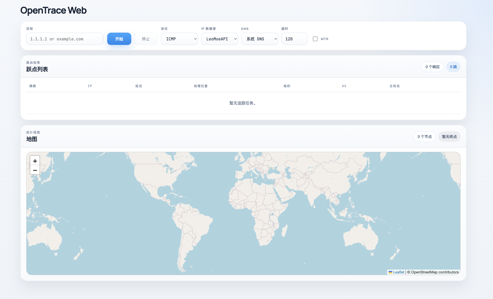

# OpenTrace Web

OpenTrace Web 是一个自托管的路由追踪服务。

它包含：

- 浏览器界面
- Go 后端
- 在服务器上执行 `nexttrace`
- 实时跃点更新和地图展示



## Docker 运行

```
docker run -d --name opentrace-web -p 8080:8080 --cap-add=NET_RAW opentrace-web:latest
```

## 构建

构建镜像：

```bash
docker buildx build --platform linux/amd64,linux/arm64 -t opentrace-web:latest .
```

运行容器：

```bash
docker run --rm -p 8080:8080 --cap-add=NET_RAW opentrace-web:latest
```

打开：

```text
http://127.0.0.1:8080
```

## 本地运行

环境要求：

- Go 1.22+
- `nexttrace`

启动：

```bash
go run ./cmd/server --nexttrace-bin /path/to/nexttrace
```

## 说明

- 路由追踪从服务器发起，不是从浏览器客户端发起
- Docker 镜像默认使用 `root` 运行
- 镜像支持 `linux/amd64` 和 `linux/arm64`
